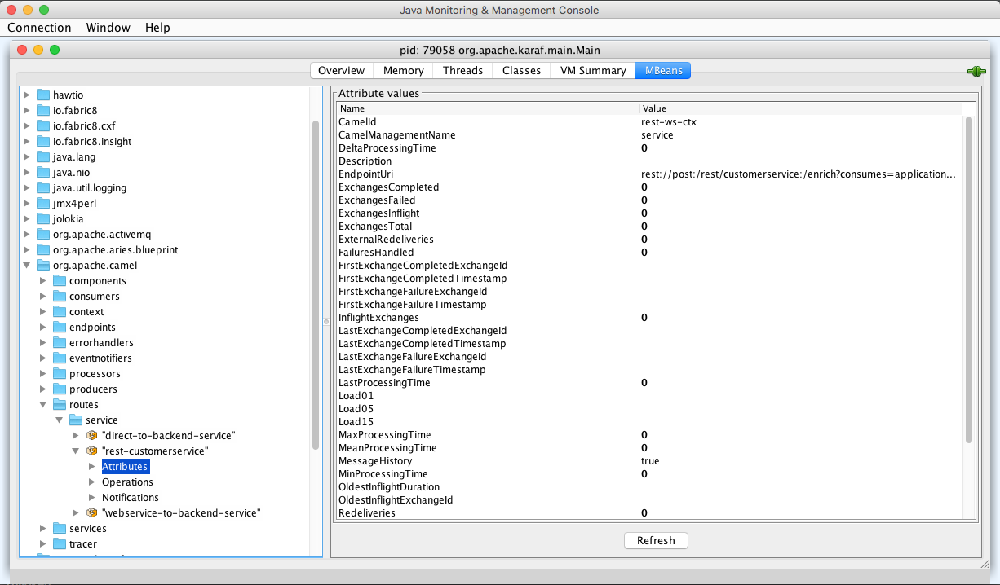

:scrollbar:
:data-uri:

== History Metrics

* Goal: Collect statistics and metrics of Camel route
* Retrieve using JMX attributes and operations

.*JMX Statistics Attributes*

ifdef::showscript[]

Transcript:

Statistics and metrics about a Camel route can be obtained in several different ways. Camel metrics are exposed via JMX attributes and operations and can be inspected via the JConsole UI. 

endif::showscript[]
