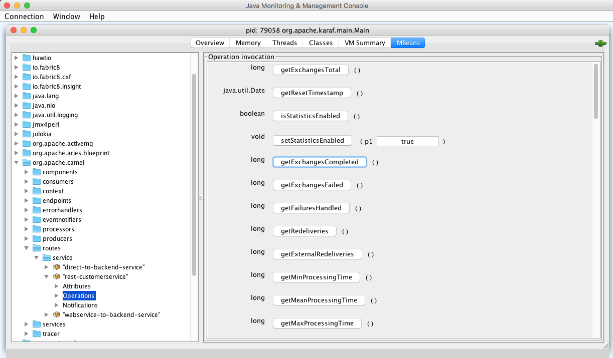

:scrollbar:
:data-uri:
:noaudio:

== History Metrics

* Can also use Camel metrics component
* At runtime metrics can be accessed from Java API/JMX, which allows gathering data as JSON output

.*JMX Statistics Operation*

ifdef::showscript[]

Transcript:

Alternatively, the Camel metrics component can be used at runtime to gather statistics. 

endif::showscript[]
