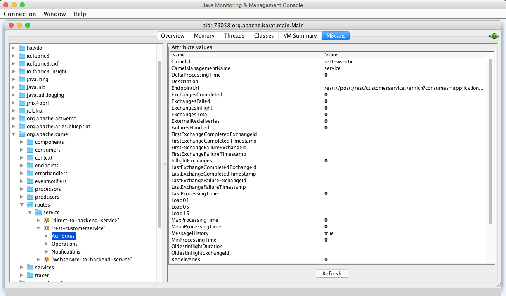

:noaudio:

[#historymetrics]
== History Metrics

* Goal : Collect stats/metrics of Camel route
* Can be retrieved using JMX attributes/operations
+
.JMX Stats Attributes

+
.JMX Stats Operation
image:images/operations.png[]
+
* Or Using camel-metrics component
* At runtime the metrics can be accessed from Java API/JMX which allows to gather the data as JSON output.
+
.History Example
[source]
----
context.addRoutePolicyFactory(new MetricsRoutePolicyFactory());

<!-- use camel-metrics route policy to gather metrics for all routes -->
<bean id="metricsRoutePolicyFactory" class="org.apache.camel.component.metrics.routepolicy.MetricsRoutePolicyFactory"/>

MetricsMessageHistoryService service = context.hasService(MetricsMessageHistoryService.class);
String json = service.dumpStatisticsAsJson();
----

ifdef::showscript[]
[.notes]
****

== History Metrics

****
endif::showscript[]